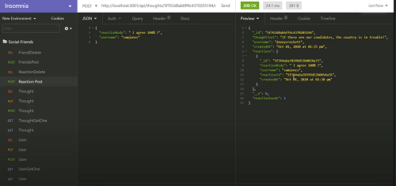

# social-friends

## Create a RESTful API for a social network.

* Build an API for a social network web application where users can share their thoughts, react to friends’ thoughts, and create a friend list.
* Use Express.js for routing, a MongoDB database, and the Mongoose ODM. 
* Use the Moment.js package to format time.

### Code snippets
```
const moment = require('moment');
const { Schema, model } = require('mongoose');
const ReactionSchema = require('./Reaction');

const ThoughtSchema = new Schema(
    {
        thoughtText: {
            type: String,
            required: 'Thought cannot be blank',
            // minlength: [1],
            maxlength: [280, 'Thought exceeded max number of characters!']
        },
        createdAt: {
            type: Date,
            default: Date.now,
            get: (createdAtVal) => moment(createdAtVal).format('MMM DD, YYYY [at] hh:mm a')
        },
        username: {
            type: String,
            required: 'You must enter your username'
        },
        reactions: 
            [ReactionSchema]
    },
    {
        toJSON: {
            virtuals: true,
            getters: true
        },
        id: false
    }
);
const Thought = model('Thought', ThoughtSchema);

// get count of reactions array field
ThoughtSchema.virtual('reactionCount').get(function () {
    return this.reactions.length;
})
module.exports = Thought;


const { User, Thought } = require('../models');
const userController = {
    // get all
    getAllUser(req, res) {
        User.find({})
            .select('-__v')
            .sort({ _id: -1 })
            .then(dbUserData => res.json(dbUserData))
            .catch(err => {
                console.log(err);
                res.status(500).json(err);
            });
    },

    // get one by id
    getUserById({ params }, res) {
        User.findOne({ _id: params.id })
            .populate('friends')
            .populate('thoughts')
            .select('-__v')
            .then(dbUserData => {
                if (!dbUserData) {
                    res.status(404).json({ message: 'No User found with this id!' });
                    return;
                }
                res.json(dbUserData);
            })
            .catch(err => {
                console.log(err);
                res.status(500).json(err);
            });
    },
    

// Delete, Update, GetById for /api/thoughts/:id
router.route('/:id')
    .put(updateThought)
    .get(getThoughtById)
    .delete(deleteThought);

// /api/thoughts/:thoughtId/reactions
router.route('/:thoughtId/reactions')
    .post(addReaction);

// /api/thoughts/:thoughtId/reactions/reactionId
router.route('/:thoughtId/reactions/:reactionId')
    .delete(deleteReaction);

```
### Walkthrough Video link


### Screenshots


